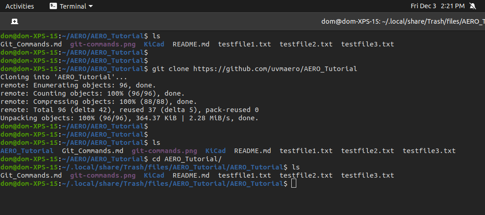

# Getting Start With Git Using Terminal

**Purpose**: Become familiar with Git commands in the Terminal

**Task**: Clone a repository, modify a file, add and push changes

**Outcome**: Understanding how to use git to get files and publish changes

## Cloning a Repo

Here I am navigating to a test file to practice making a change:


## Modify the File

Here I am modifing the file (just in my terminal editor because this is a .txt, we would use and IDE for actual code)


## "Save" Changes

Now I am staging my changes with the ```git add``` command so I can then commit and push them


## Push Changes

Finally, on Github we can see that my changes successfully pushed and can be viewed by others!

