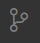

# Getting Start With VSCode

**Purpose**: Become familiar with VSCode and Extensions

**Task**: Install software, instll extensions, use VSCode to commit a code change

**Outcome**: Working VSCode sofware with understanding of how to make future customization and use of the software

## Getting the client

[VSCode](https://code.visualstudio.com/) at it's base is a text editor. There are a lot of extensions that are built on top of VSCode that support text highlighting, version control, live code collaboration, and much more. For now we'll be using only a few of the many features. 

## Extensions

Open a new VSCode window. On the task bar on the left, click on the `Extensions` block.

 Now install the following: 

 - C/C++ Extension Pack
 - Python
 - PlatformIO IDE (Actually we're moving away from this, so don't worry about install this)

 For now you'll be using just text files and source control which are built in functionality. In future tutorials, you'll also be editing code, so add these extensions to make future things easier. 

 ## Source Control (Git)

 When the term "Source Control" is used, we use Git. As mentioned in other documentation, Git is Source Control, GitHub is the online hosting service for all the repos. In VSCode, you can access source ontrol using the branch icon on the left. 
 
  
 
 **NOTE** VSCode must be in a folder with a valid git repo. If you just opened a window, you can go to `File > Open Folder` to open a folder (*cough* *cough* **AERO_Tutorials**). 

## Using Source Control

It is recommended to do the [GitHub Desktop](Tutorials/1_GitHub_GettingStarted.md) Tutorial first. Once you see how to use the desktop, VSCode is very similar. 

With the AERO_Tutorial folder open, let's modify the `favorite-color.txt` file in `data`. Add your favorite color. Save that change and go to the Source Control Tab.  You'll see the files that have been modified in your local repo and not yet committed. To add the file, press the `+` symbol that appears when you hover over the file. This adds it to the staged changes. Next, in the message box at the top, type in a commit message (remember, keep short and consise). Then press ctrl+enter to commit the change. Finally press "Sync Changes" button that should appear. 

That's it, you successfully changed, committed and pushed a file! If you run into troubles, it's likely because you didn't commit properly, or there's a merge conflict.

## Merge Conflicts

Merge conflicts are what happens when two of the same files were committed to the branch with conflicting information. 

For example, let's say John and Sarah are working on `favorite-animals.txt` at the same time and John changes line 4 to say "Dog" while Sarah changes line 4 to say "Cat". Both can commit the file in the way you just did. If Sarah tries to push the changes, they can. Now when John tries to push the changes, their local repository is actually old and the push won't work since John's change to the file would conflict with Sarah's. 

Git will prompt you when this happens and VSCode has a nice tool to deal with merge conflicts. While still in the Source Control Tab, select each file that had a conflict and VSCode will highlight the differences. There should be a small words above each change that says "Accept Incomming" or "Accept Both" or other options. For now, let's except both changes. 

Now the file will have both changed incorporate. From our example earlier, the "Dog" and "Cat" are now both in the file. Next, commit the merge. VSCode likely already made a message for you. You can use that one or write a different message. Then push your changes. 

Contrats, you just handled your first merge conflict! 